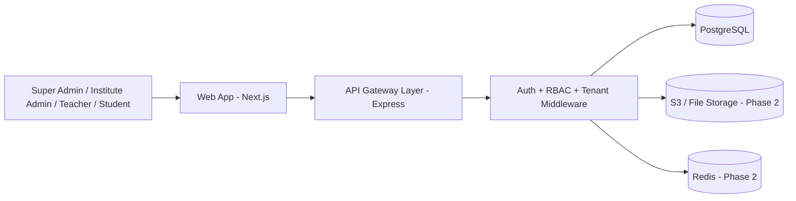
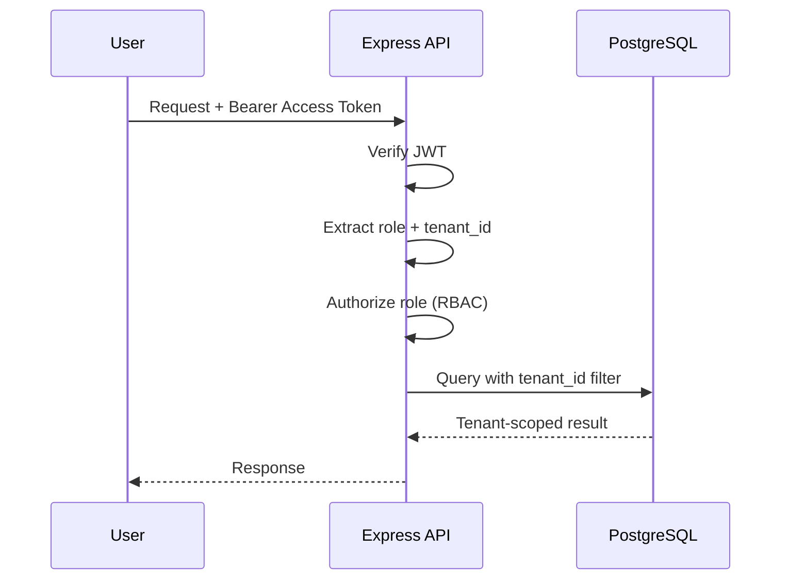
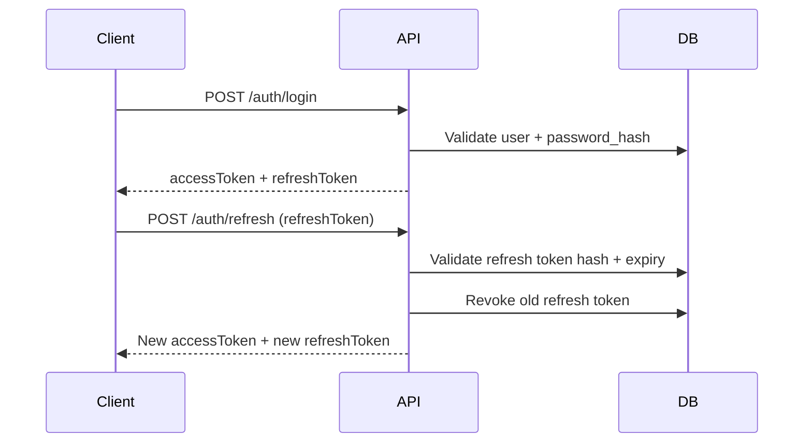
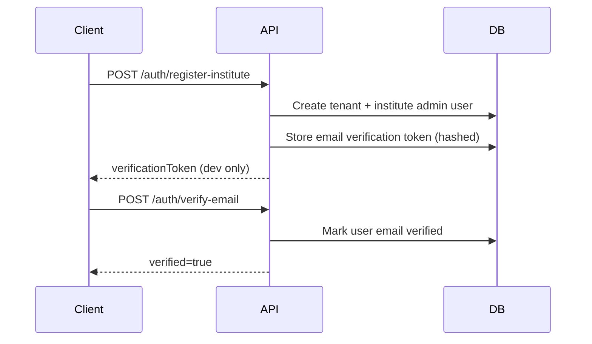

# Phase 1 Architecture

## 1) Multi-Tenant Strategy Decision

Chosen for MVP: **Shared database + shared tables + strict `tenant_id` filtering**.

Why for Phase 1:
- Fast to ship and affordable for early-stage startup
- Easier analytics and maintenance
- Can evolve to schema/database isolation later for enterprise tenants

Future upgrade path:
- Hybrid isolation (premium plans on dedicated schema/database)

## 2) High-Level System Diagram

## 3) Request Isolation Flow

## 4) Authentication Flow

## 4.1) Email Verification (Phase 1.3)

## 5) RBAC Roles

- `super_admin`: Platform-wide visibility and controls
- `institute_admin`: Manage institute users/data
- `teacher`: Teaching and student-related operations (Phase 2 expansion)
- `student`: Own data access only (Phase 2 expansion)
- `staff`: Institute operational staff (Phase 1.4)

## 6) Data Model Snapshot

Key tables:
- `tenants`
- `users`
- `refresh_tokens`
- `students`
- `teachers`
- `password_reset_tokens`
- `notifications`
- `courses`
- `batches`
- `course_teachers`
- `batch_students`
- `migration_history`

Tenant isolation rule:
- Every institute-owned record must include `tenant_id`
- Every tenant route must read `tenant_id` from verified token

## 7) Security Baseline (Phase 1)

- Password hashing with `bcrypt`
- JWT access + refresh token model
- Refresh token hashing (SHA-256) before DB storage
- Rate limit on login endpoint
- `helmet` for HTTP hardening
- `cors` allowlist via environment variable
- Zod request validation
- Email verification tokens stored hashed
- Password reset tokens stored hashed
